# Сегментация клиентов банка

```python
# Импорт основных библиотек
import numpy as np
import pandas as pd

# Импорт библиотек машинного обучения
from sklearn.model_selection import train_test_split
from sklearn.preprocessing import MinMaxScaler
from sklearn.cluster import KMeans, AgglomerativeClustering, DBSCAN
from sklearn.decomposition import PCA
from sklearn.manifold import TSNE
from sklearn.metrics import silhouette_score
from umap import UMAP

# Импорт библиотек построения графиков и диаграмм
from matplotlib import pyplot as plt
import seaborn as sns

# Указание режима отображения диаграмм
%matplotlib inline

# Настройка параметров среды Pandas
pd.set_option("display.max_columns", 200)
```

### Загрузка исходных данных
```python
# Загрузка исходных данных о клиентах банка
bank_df = pd.read_csv('german_credit_data.csv', sep=',', encoding='ANSI', index_col=0)

# Вывод загруженных данных
bank_df.head()
```
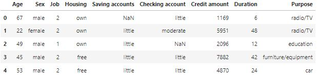

```python
# Задание удобных наименований признакам
bank_df.columns = ['age', 'sex', 'job', 'housing', 'saving_accounts', 'checking_account',
                   'credit_amount', 'duration', 'purpose']
```

### Разведочный анализ данных
```python
# Сводная информация о структуре исходных данных
bank_df.info()
```
```
<class 'pandas.core.frame.DataFrame'>
Int64Index: 1000 entries, 0 to 999
Data columns (total 9 columns):
 #   Column            Non-Null Count  Dtype 
---  ------            --------------  ----- 
 0   age               1000 non-null   int64 
 1   sex               1000 non-null   object
 2   job               1000 non-null   int64 
 3   housing           1000 non-null   object
 4   saving_accounts   817 non-null    object
 5   checking_account  606 non-null    object
 6   credit_amount     1000 non-null   int64 
 7   duration          1000 non-null   int64 
 8   purpose           1000 non-null   object
dtypes: int64(4), object(5)
memory usage: 78.1+ KB
```

```python
# Вывод основных статистик по количественным признакам
bank_df.describe(include=[np.number])
```
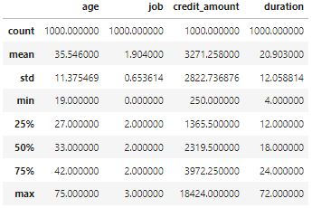

```python
# Вывод основных статистик по категориальным и строковым признакам
bank_df.describe(include=[object])
```
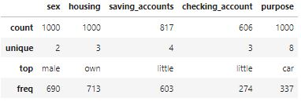

Будем считать, что количество пропусков в **saving_accounts** и **checking_account** не повлияет на дальнейший анализ сегментации клиентов банка. Отбрасываем строки с пропущенными значениями для **saving_accounts** и удаляем признак **checking_account**.

```python
# Удаление строк из исходных данных с отсутствующими значениями для "saving_accounts"
bank_df.dropna(subset=['saving_accounts'], inplace=True)

# Удаление признака "checking_account" из исходных данных, по причине отсутствия значительной части данных
bank_df.drop(columns=['checking_account'], inplace=True)
```
Используя матрицу рассеивания отразим парное отношение признаков и их распределение.

```python
# Отображение парных отношений признаков и их распределение
sns.pairplot(bank_df, diag_kind='hist', height=2)

# Вывод диаграммы
plt.show()
```
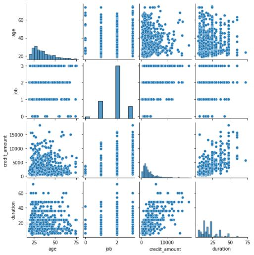

Из матрицы рассеивания видно, что признак **job** лучше преобразовать в категориальный признак.

```python
# Изменение типа данных признака "job" на строковый
bank_df.job = bank_df.job.astype(object)

# Замена числовых значений на категориальные значения
bank_df.job = bank_df.job.map({0: 'NonResident', 1: 'Resident', 2: 'Skilled', 3: 'HighlySkilled'})
```
Полученная матрица рассеивания не отражает всех признаков и полной картины линейных взаимосвязей, поэтому имеет смысл ввести дополнительные признаки посредством применения бинарного кодирования (one-hot encoding) к категориальным значениям.

```python
# Преобразование категориальных признаков в бинарные признаки
bank_df = pd.get_dummies(bank_df, columns=bank_df.columns[bank_df.dtypes==object], drop_first=True)

# Задание удобных наименований признакам
column_list = {'credit_amount': 'credit_Amount', 'sex_male': 'sex_Male', 'housing_own': 'housing_Own', 'housing_rent': 'housing_Rent',
               'saving_accounts_moderate': 'saving_accounts_Moderate', 'saving_accounts_quite rich': 'saving_accounts_QuiteRich',
               'saving_accounts_rich': 'saving_accounts_Rich', 'checking_account_moderate': 'checking_account_Moderate',
               'checking_account_rich': 'checking_account_Rich', 'purpose_car': 'purpose_Car', 
               'purpose_domestic appliances': 'purpose_DomesticAppliances', 'purpose_education': 'purpose_Education', 
               'purpose_furniture/equipment': 'purpose_FurnitureEquipment', 'purpose_radio/TV': 'purpose_RadioTV',
               'purpose_repairs': 'purpose_Repairs', 'purpose_vacation/others': 'purpose_VacationOthers'}
bank_df.rename(columns=column_list, inplace=True)

# Вывод новых признаков
bank_df.head()
```
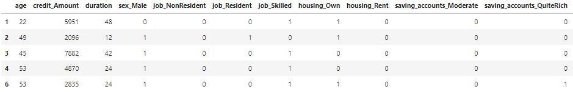

```python
# Создание цветовой карты для подсвечивания сильных связей
color_map = sns.color_palette(['#d7301f', '#fcae91', '#f7f7f7', '#f7f7f7', '#f7f7f7', '#f7f7f7', '#9ecae1', '#08519c'])

# Определение размера диаграммы
plt.figure(figsize=(13, 10))

# Вывод матрицы корреляции для оценки степени линейной зависимости между признаками
ax = sns.heatmap(
    bank_df.corr(), cmap=color_map, square=True, vmin=-1, vmax=1, center= 0,
    linewidths=0.1, linecolor='white', annot=True, fmt='.1g', 
    cbar_kws=dict(ticks=np.arange(-1.0, 1.1, 0.25), aspect=25))

# Вывод диаграммы
plt.show()
```
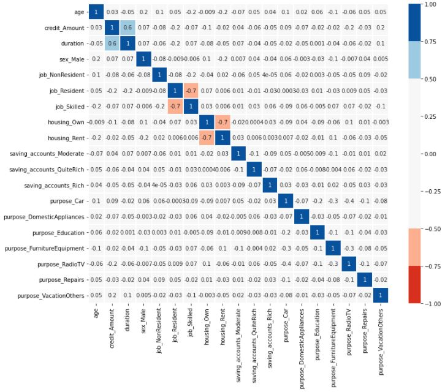

В соответствии с полученной матрицей корреляции можно сказать, что признаки: **housing_Own**, **housing_Rent**, **job_Resident**, **job_Skilled** достаточно сильно коррелирует друг с другом. Соответственно признаки **housing_Own** и **job_Resident** можно удалить из набора исходных данных.

```python
# Удаление сильно коррелирующих признаков
bank_df = bank_df.drop(columns=['housing_Own', 'job_Resident'])
```
### Предварительная обработка данных
Приведем признаки к одному масштабу, поскольку не все алгоритмы машинного обучения могут хорошо работать с данными из разного диапазона. Выполним масштабирование признаков в диапазоне от 0 до 1.
```python
# Нормализация значений признаков
X_scaled = MinMaxScaler().fit_transform(bank_df)
```
### Построение моделей
```python
# Максимальное число кластеров
CLUSTERS = 10
```
#### K-means кластеризация
```python
# Построение модели кластеризации для различных групп кластеров
inertias, silhouettes = [], []
for n in range(2, CLUSTERS + 1):
    model = KMeans(n_clusters=n, random_state=42).fit(X_scaled)
    inertias.append(model.inertia_)
    # Определение коэффициента силуэта для каждой группы кластеров
    silhouettes.append(silhouette_score(X_scaled, model.labels_))

# Определение коэффициента локтя для каждой группы кластеров
coeff_d = []
for i in range(1, CLUSTERS-2):
    coeff_d.append((inertias[i] - inertias[i+1]) / (inertias[i-1] - inertias[i]))

# Определение основных объектов диаграмм
fig, axes = plt.subplots(1, 3, figsize=(16,4))

# Построение графиков зависимости коэффициента от количества кластеров
sns.lineplot(x=range(2, CLUSTERS + 1), y=inertias, marker='o', ax=axes[0])
sns.lineplot(x=range(3, CLUSTERS), y=coeff_d, marker='o', ax=axes[1])
sns.lineplot(x=range(2, CLUSTERS + 1), y=silhouettes, marker='o', ax=axes[2])

# Вывод заголовков и подписей осей координат
axes[0].set(title='Метод локтя \n(коэффициент K-means)', xlabel='Количество кластеров', ylabel='Коэффициент K-means')
axes[1].set(title='Метод локтя \n(коэффициент локтя)', xlabel='Количество кластеров', ylabel='Коэффициент локтя')
axes[2].set(title='Коэффициент силуэта', xlabel='Количество кластеров', ylabel='Коэффициент силуэта')

# Вывод диаграмм
plt.show()
```
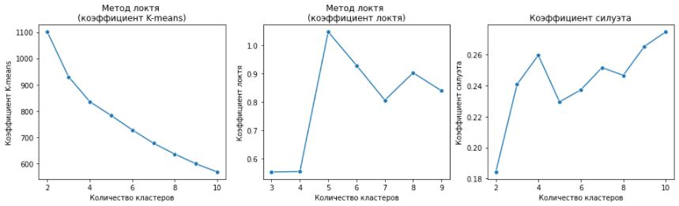

Из диаграммы **"Метод локтя"** видно, что при кластеризации K-means наиболее оптимальным количеством кластеров будет **3 или 4 кластера**. В соответствии с диаграммой **"Коэффициент силуэта"** оптимальным количеством является **4 кластера**. Поэтому считаем, что **4 кластера** является наиболее оптимальным количеством кластеров при кластеризации K-means.

```python
# Построение модели кластеризации для выбранного количества кластеров
kmeans_model = KMeans(n_clusters=4, random_state=42).fit(X_scaled)

# Уменьшение размерности признакового пространства методами PCA, TSNE и UMAP
pca_model = PCA(n_components=2, random_state=42).fit_transform(X_scaled)
tsne_model = TSNE(n_components=2, random_state=42).fit_transform(X_scaled)
umap_model = UMAP(n_components=2, random_state=42).fit_transform(X_scaled)

# Определение основных объектов диаграмм
fig, axes = plt.subplots(1, 3, figsize=(16,4))

# Вывод признаковых пространств сжатых алгоритмами PCA, TSNE и UMAP
sns.scatterplot(x=pca_model[:, 0], y=pca_model[:, 1], ax=axes[0], hue=kmeans_model.labels_)
sns.scatterplot(x=tsne_model[:, 0], y=tsne_model[:, 1], ax=axes[1], hue=kmeans_model.labels_)
sns.scatterplot(x=umap_model[:, 0], y=umap_model[:, 1], ax=axes[2], hue=kmeans_model.labels_)

# Вывод заголовков диаграмм
axes[0].set_title('Метод PCA')
axes[1].set_title('Метод TSNE')
axes[2].set_title('Метод UMAP')

# Вывод диаграмм
plt.show()
```
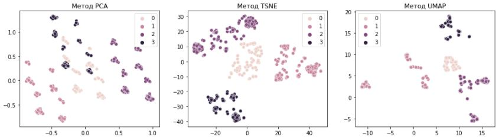

Из полученных результатов видно, что наилучший результат показал метод снижения размерности **TSNE** c количеством кластеров равным **4**.

#### Иерархическая кластеризация
```python
# Построение моделей кластеризации для различных групп кластеров
silhouettes = [[], []]
for n in range(2, CLUSTERS + 1):
    silhouettes[0].append(silhouette_score(X_scaled, AgglomerativeClustering(n_clusters=n, linkage='ward').fit(X_scaled).labels_))
    silhouettes[1].append(silhouette_score(X_scaled, AgglomerativeClustering(n_clusters=n, linkage='single').fit(X_scaled).labels_))

# Определение основных объектов диаграмм
fig, axes = plt.subplots(1, 2, figsize=(16,4))

# Построение графиков зависимости коэффициента от количества кластеров
sns.lineplot(x=range(2, CLUSTERS + 1), y=silhouettes[0], marker='o', ax=axes[0])
sns.lineplot(x=range(2, CLUSTERS + 1), y=silhouettes[1], marker='o', ax=axes[1])
    
# Вывод заголовков диаграмм
axes[0].set(title='Коэффициент силуэта (Ward)', xlabel='Количество кластеров', ylabel='Коэффициент силуэта')
axes[1].set(title='Коэффициент силуэта (Single)', xlabel='Количество кластеров', ylabel='Коэффициент силуэта')

# Вывод диаграмм
plt.show()
```
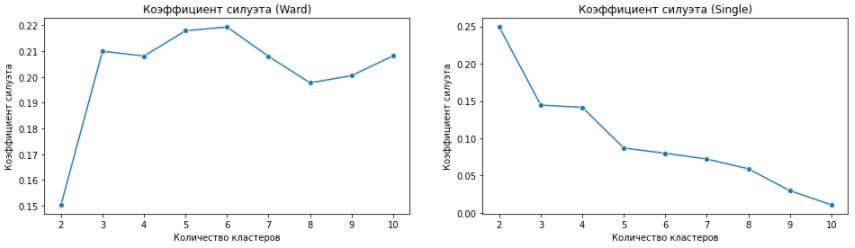

Согласно полученных диаграмм для критерия связи **Ward** лучшее разделение объектов на кластеры достигается при количестве кластеров равным **6**, для критерия связи **Single** - **3 или 4 кластера**.

```python
# Построение модели кластеризации для выбранного количества кластеров
agg_model = [AgglomerativeClustering(n_clusters=6, linkage='ward').fit(X_scaled),
             AgglomerativeClustering(n_clusters=3, linkage='single').fit(X_scaled)]

# Уменьшение размерности признакового пространства методами PCA, TSNE и UMAP
pca_model = PCA(n_components=2, random_state=42).fit_transform(X_scaled)
tsne_model = TSNE(n_components=2, random_state=42).fit_transform(X_scaled)
umap_model = UMAP(n_components=2, random_state=42).fit_transform(X_scaled)

# Определение основных объектов диаграмм
fig, axes = plt.subplots(2, 3, figsize=(16,10))

# Вывод признаковых пространств сжатых алгоритмами PCA, TSNE и UMAP
sns.scatterplot(x=pca_model[:, 0], y=pca_model[:, 1], ax=axes[0, 0], hue=agg_model[0].labels_)
sns.scatterplot(x=tsne_model[:, 0], y=tsne_model[:, 1], ax=axes[0, 1], hue=agg_model[0].labels_)
sns.scatterplot(x=umap_model[:, 0], y=umap_model[:, 1], ax=axes[0, 2], hue=agg_model[0].labels_)
sns.scatterplot(x=pca_model[:, 0], y=pca_model[:, 1], ax=axes[1, 0], hue=agg_model[1].labels_)
sns.scatterplot(x=tsne_model[:, 0], y=tsne_model[:, 1], ax=axes[1, 1], hue=agg_model[1].labels_)
sns.scatterplot(x=umap_model[:, 0], y=umap_model[:, 1], ax=axes[1, 2], hue=agg_model[1].labels_)

# Вывод заголовков диаграмм
axes[0, 0].set_title('Метод PCA \n(критерий связи Ward)')
axes[0, 1].set_title('Метод TSNE \n(критерий связи Ward)')
axes[0, 2].set_title('Метод UMAP \n(критерий связи Ward)')
axes[1, 0].set_title('Метод PCA \n(критерий связи Single)')
axes[1, 1].set_title('Метод TSNE \n(критерий связи Single)')
axes[1, 2].set_title('Метод UMAP \n(критерий связи Single)')

# Вывод диаграмм
plt.show()
```
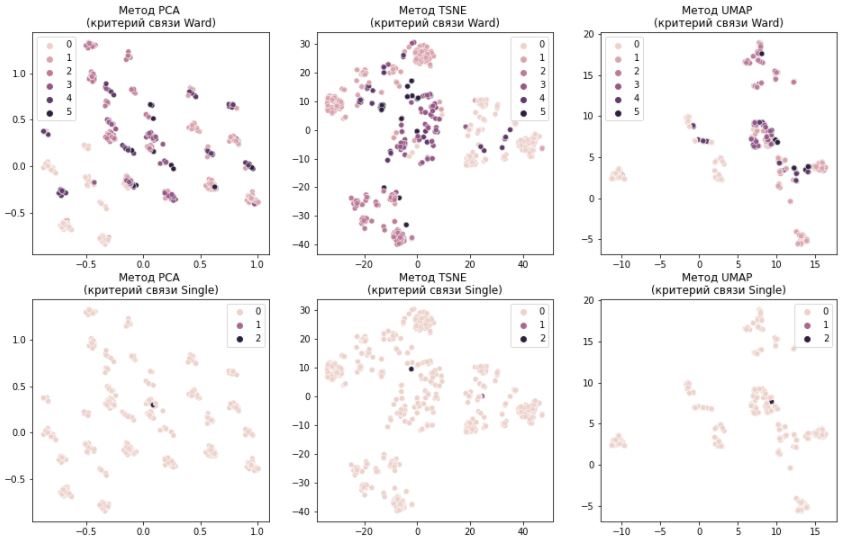

Полученный результат показывает, что при критерии связи **Single** агломеративная кластеризация **не может разделить объекты на кластеры**. С использованием метода **Ward** достигнуть четкого визуального разделения на кластеры **также не получается**.

#### DBSCAN кластеризация
```python
# Задание интервала окрестности точки кластера
eps_range = np.arange(0.1, 2, 0.1)

# Инициализация массива под коэффициент силуэта и количества кластеров
data = np.hstack((np.array(eps_range)[:, None], np.zeros(eps_range.shape)[:, None], np.zeros(eps_range.shape)[:, None]))

# Построение модели кластеризации для различных групп кластеров
for i in range(len(eps_range)):
    model = DBSCAN(eps=data[i, 0]).fit(X_scaled)
    data[i, 1] = len(np.unique(model.labels_) != -1)
    data[i, 2] = silhouette_score(X_scaled, model.labels_) if data[i, 1] > 1 else 0

# Определение основных объектов диаграмм
fig, axes = plt.subplots(1, 2, figsize=(16,4))

# Построение графиков зависимости коэффициента от количества кластеров для всего интервала окрестности
sns.lineplot(x=data[:, 0], y=data[:, 2], marker='o', ax=axes[0], color='tab:red')
clusters_axes = sns.lineplot(x=data[:, 0], y=data[:, 1], marker='o', ax=axes[0].twinx(), color='tab:blue')

# Вывод заголовка диаграмм и подписей осей
axes[0].set(title='Коэффициент силуэта \n(EPS от 0.1 до 2)', xlabel='EPS (окрестность)')
axes[0].set_ylabel('Коэффициент силуэта', color='tab:red')
axes[0].tick_params(axis='y', labelcolor='tab:red')
clusters_axes.set_ylabel('Количество кластеров')

# Построение графиков зависимости коэффициента от количества кластеров для заданного интервала окрестности
sns.lineplot(x=data[data[:,0]>1, 0], y=data[data[:,0]>1, 2], marker='o', ax=axes[1], color='tab:red')
clusters_axes = sns.lineplot(x=data[data[:,0]>1, 0], y=data[data[:,0]>1, 1], marker='o', ax=axes[1].twinx(), color='tab:blue')

# Вывод заголовка диаграмм и подписей осей
axes[1].set(title='Коэффициент силуэта \n(EPS от 1 до 2)', xlabel='EPS (окрестность)')
axes[1].set_ylabel('Коэффициент силуэта', color='tab:red')
axes[1].tick_params(axis='y', labelcolor='tab:red')
clusters_axes.set_ylabel('Количество кластеров')

# Вывод диаграмм
plt.show()
```
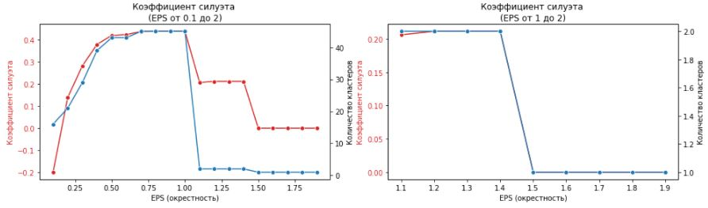

Из диаграммы **"Коэффициент силуэта"** видно, что наиболее оптимальными значениями **окрестности (EPS)** являются значения для количества кластеров не превышающих 20. Рассмотрим значения окрестности равной **0.25** и **1.3**.

```python
# Построение модели кластеризации для выбранной окрестности
dbscan_model = [DBSCAN(eps=0.25).fit(X_scaled), DBSCAN(eps=1.3).fit(X_scaled)]

# Снижение размерности признакового пространства методами PCA, TSNE и UMAP
pca_model = PCA(n_components=2, random_state=42).fit_transform(X_scaled)
tsne_model = TSNE(n_components=2, random_state=42).fit_transform(X_scaled)
umap_model = UMAP(n_components=2, random_state=42).fit_transform(X_scaled)

# Определение основных объектов диаграммы
fig, axes = plt.subplots(2, 3, figsize=(16,10))

# Вывод признаковых пространств сжатых алгоритмами PCA, TSNE и UMAP
sns.scatterplot(x=pca_model[:, 0], y=pca_model[:, 1], ax=axes[0, 0], hue=dbscan_model[0].labels_)
sns.scatterplot(x=tsne_model[:, 0], y=tsne_model[:, 1], ax=axes[0, 1], hue=dbscan_model[0].labels_)
sns.scatterplot(x=umap_model[:, 0], y=umap_model[:, 1], ax=axes[0, 2], hue=dbscan_model[0].labels_)
sns.scatterplot(x=pca_model[:, 0], y=pca_model[:, 1], ax=axes[1, 0], hue=dbscan_model[1].labels_)
sns.scatterplot(x=tsne_model[:, 0], y=tsne_model[:, 1], ax=axes[1, 1], hue=dbscan_model[1].labels_)
sns.scatterplot(x=umap_model[:, 0], y=umap_model[:, 1], ax=axes[1, 2], hue=dbscan_model[1].labels_)

# Вывод заголовка диаграмм
axes[0, 0].set_title('Метод PCA \n(Eps = 0.25)')
axes[0, 1].set_title('Метод TSNE \n(Eps = 0.25)')
axes[0, 2].set_title('Метод UMAP \n(Eps = 0.25)')
axes[1, 0].set_title('Метод PCA \n(Eps = 1.3)')
axes[1, 1].set_title('Метод TSNE \n(Eps = 1.3)')
axes[1, 2].set_title('Метод UMAP \n(Eps = 1.3)')

# Вывод диаграмм
plt.show()
```
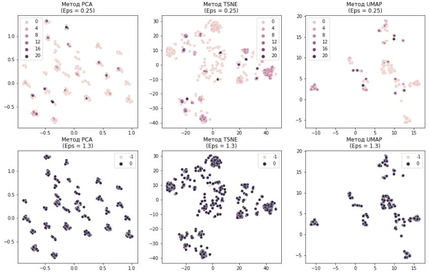

В результате применения алгоритмов снижения размерности видно, что плотностный алгоритм кластеризации **DBSCAN не смог хорошо разбить данные** на кластеры.

### Интерпретация моделей
```python
# Определение списка числовых признаков
columns = bank_df.dtypes[bank_df.dtypes=='int64'].index.tolist()
```

#### K-means кластеризация
```python
# Добавление меток кластеров в датафрейм
bank_df['labels'] = kmeans_model.labels_

# Вывод среднего значения в разрезе кластера и признака
bank_df.groupby('labels').mean().T.round(2)
```
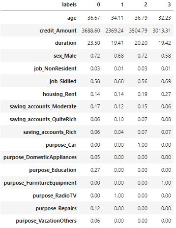

```python
# Определение основных объектов диаграммы
fig, axes = plt.subplots(1, 3, figsize=(16,5))

# Построение графиков распределений значений признака в разрезе кластеров
for i in range(3):
    sns.boxplot(data=bank_df, x=columns[i], y='labels', orient='h', ax=axes.flat[i])

# Вывод диаграмм
plt.show()
```
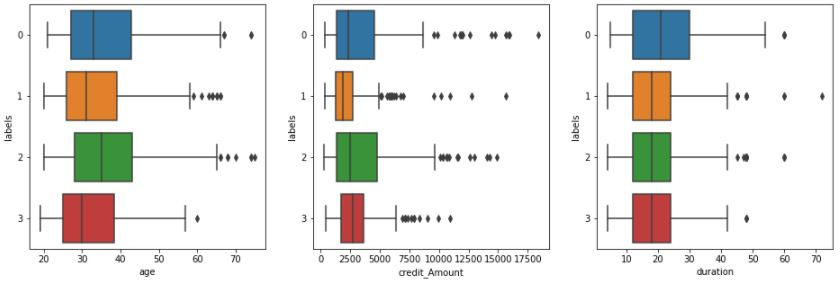

Из полученных результатов сегментации клиентов методом **K-means** можно отметить следующее:
- Согласно таблицы матожиданий алгоритм кластеризации K-means разделил клиентов на кластеры в соответствии с назначением кредитов, относительно других признаков подобное деление не наблюдается;
- Из полученных boxplot-ов в разрезе признаков Age, Credit Amount и Duration не наблюдается значительного отличия в кластерах, распределение значений примерно одинаково.

#### Иерархическая кластеризация
```python
# Добавление меток кластеров в датафрейм
bank_df['labels'] = agg_model[0].labels_

# Вывод среднего значения в разрезе кластера и признака
bank_df.groupby('labels').mean().T.round(2)
```
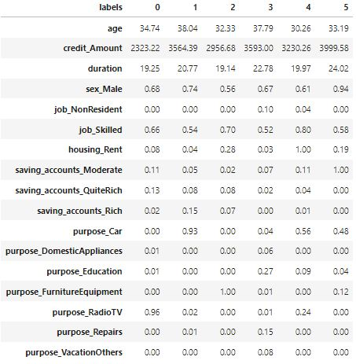

```python
# Определение основных объектов диаграммы
fig, axes = plt.subplots(1, 3, figsize=(16,5))

# Построение графиков распределений значений признака в разрезе кластеров
for i in range(3):
    sns.boxplot(data=bank_df, x=columns[i], y='labels', orient='h', ax=axes.flat[i])

# Вывод диаграмм
plt.show()
```
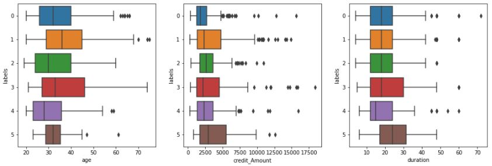

Из полученных результатов сегментации клиентов с помощью **Иерархической кластеризации** можно отметить следующее:
- Из таблицы матожиданий видно, что алгоритм Иерархической кластеризации разделил клиентов на группы трудно поддающиеся интерпретации;
- Boxplot-ы также показывают примерно одинаковое распределение значений между группами.

#### DBSCAN кластеризация
```python
# Добавление меток кластеров в датафрейм
bank_df['labels'] = dbscan_model[0].labels_

# Вывод медианного значения в разрезе кластера и числового признака
bank_df.groupby('labels').mean().T.round(2)
```
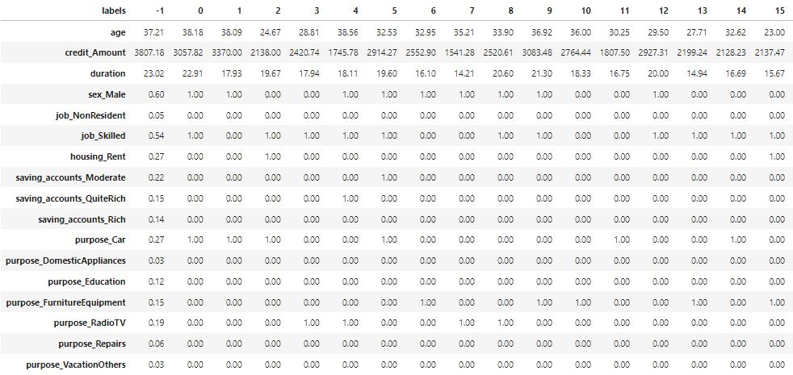

```python
# Определение основных объектов диаграммы
fig, axes = plt.subplots(1, 3, figsize=(16,12))

# Построение графиков распределений значений признака в разрезе кластеров
for i in range(3):
    sns.boxplot(data=bank_df, x=columns[i], y='labels', orient='h', ax=axes.flat[i])

# Вывод диаграмм
plt.show()
```
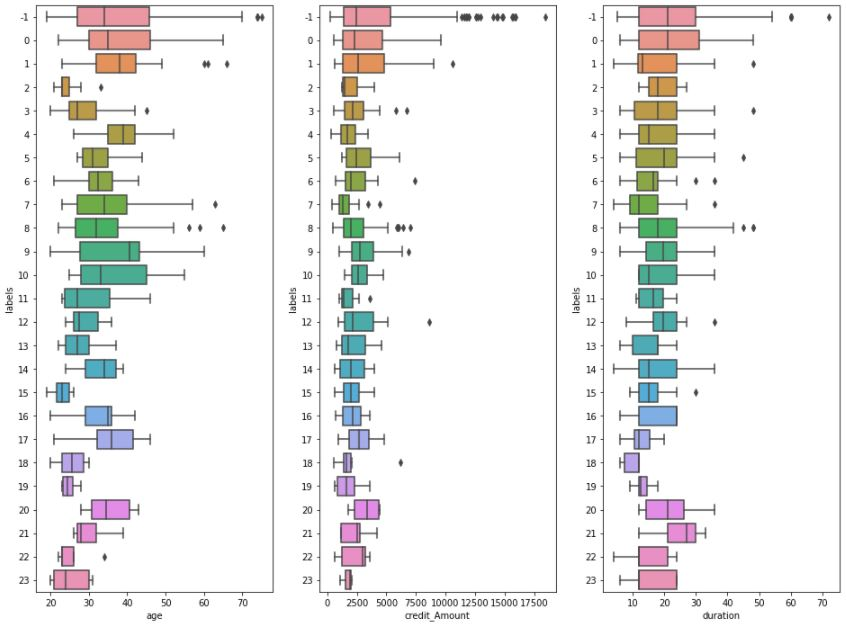

Полученные результаты DBSCAN кластеризации не поддаются интерпретации.
